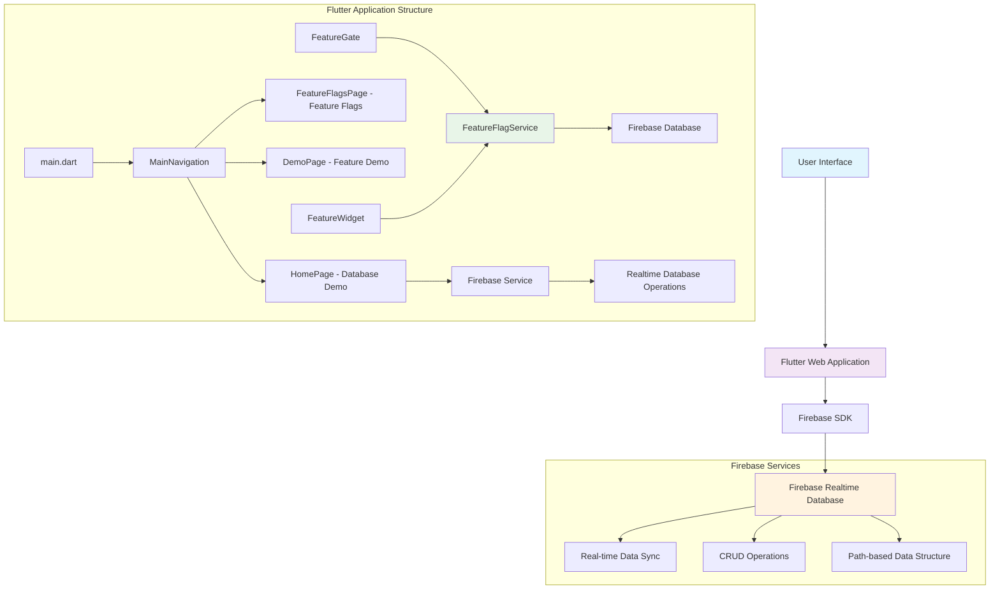
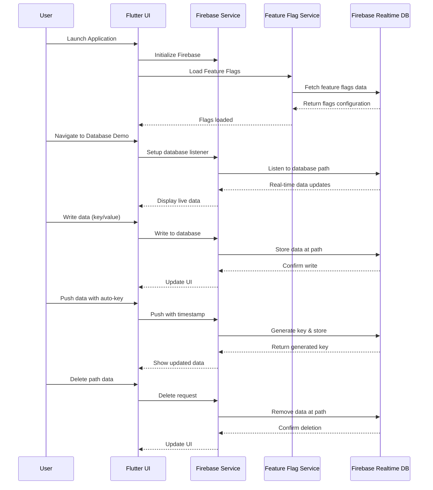
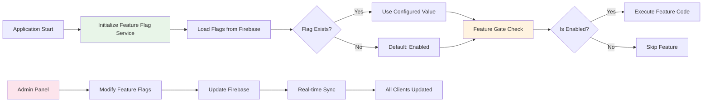
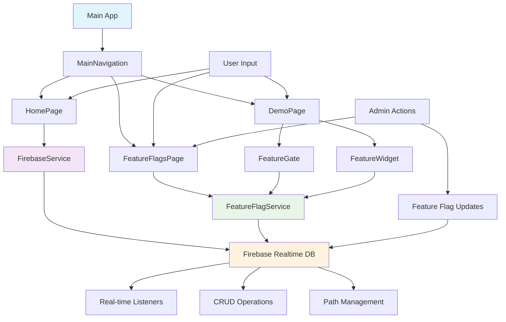
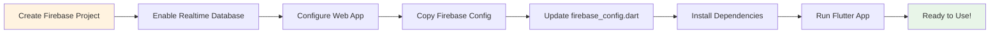

# Flutter Firebase Web App Architecture Diagram

## System Architecture Overview



## Application Flow Diagram



## Feature Flags System Architecture



## Database Structure Diagram

```mermaid
graph TD
    A[Firebase Realtime Database] --> B[Root]
    
    B --> C[feature_flags/]
    C --> D[enabled/]
    C --> E[userGroups/]
    
    D --> F[feature1: true]
    D --> G[feature2: false]
    
    E --> H[hse/]
    E --> I[admin/]
    
    H --> J[feature1: true]
    H --> K[feature2: false]
    
    I --> L[feature1: true]
    I --> M[adminFeature: true]
    
    B --> N[Custom Data Paths]
    N --> O[users/]
    N --> P[messages/]
    N --> Q[test/]
    
    O --> R[user1: {name, email}]
    P --> S[auto-key: {message, timestamp}]
    Q --> T[name: "John Doe"]

    style A fill:#fff3e0
    style C fill:#e8f5e8
    style N fill:#e1f5fe
```

## Component Interaction Diagram



## Key Features Overview

### 🔥 Firebase Integration
- **Real-time Database**: Live data synchronization
- **Web Configuration**: Optimized for Flutter Web
- **Path-based Structure**: Flexible data organization

### 🎛️ Feature Flag System
- **User Group Support**: Different configurations per group
- **Default Behavior**: Enabled by default if not set
- **Real-time Updates**: Changes sync across all clients
- **Admin Interface**: Easy flag management

### 🖥️ User Interface
- **Responsive Design**: Works on all screen sizes
- **Three Main Sections**:
  1. **Database Demo**: Direct database operations
  2. **Feature Flags**: Flag management interface
  3. **Demo Page**: Feature flag demonstrations

### 🛠️ Core Operations
- **Write Data**: Store key-value pairs
- **Push Data**: Auto-generated keys with timestamps
- **Delete Data**: Remove data at specific paths
- **Real-time Listening**: Live data updates
- **Path Switching**: Dynamic database path changes

## Setup Flow

