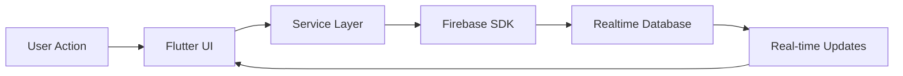

# 🔥 Flutter Firebase Realtime Database Web App

> A comprehensive Flutter web application with Firebase Realtime Database integration and advanced feature flag management system.

## 📋 Table of Contents

- [Overview](#overview)
- [Features](#features)
- [Quick Start](#quick-start)
- [Installation Guide](#installation-guide)
- [Configuration](#configuration)
- [Usage Guide](#usage-guide)
- [Architecture](#architecture)
- [API Reference](#api-reference)
- [Troubleshooting](#troubleshooting)
- [Contributing](#contributing)

---

## 🎯 Overview

This Flutter web application demonstrates real-time database operations using Firebase Realtime Database. It features a sophisticated feature flag system with user group support, making it perfect for:

- **Real-time data management**
- **Feature flag administration**
- **Live data synchronization**
- **User group-based configurations**
- **Dynamic content rendering**

### 🌟 Key Highlights

| Feature | Description | Status |
|---------|-------------|---------|
| Real-time Sync | Live data updates across all clients | ✅ Active |
| Feature Flags | User group-based feature management | ✅ Active |
| Web Optimized | Responsive design for all screen sizes | ✅ Active |
| CRUD Operations | Complete database management | ✅ Active |
| Admin Panel | Easy feature flag administration | ✅ Active |

---

## 🚀 Features

### 📊 Database Operations
- **Real-time Data Listening**: Automatic updates when data changes
- **Write Operations**: Store key-value pairs at specific paths
- **Push Operations**: Auto-generated keys with timestamps
- **Delete Operations**: Remove data from specific database paths
- **Dynamic Path Switching**: Change listening paths on the fly

### 🎛️ Feature Flag System
- **User Group Support**: Different configurations per user group
- **Default Behavior**: Features enabled by default if not explicitly configured
- **Real-time Updates**: Changes propagate instantly to all clients
- **Admin Interface**: User-friendly management panel
- **Conditional Rendering**: Show/hide UI elements based on flags

### 🖥️ User Interface
- **Three Main Panels**:
  1. **Database Demo**: Direct database operations and testing
  2. **Feature Flags**: Administrative control panel
  3. **Demo Page**: Live feature flag demonstrations
- **Responsive Design**: Optimized for desktop and mobile browsers
- **Real-time Feedback**: Instant visual updates

---

## ⚡ Quick Start

### Prerequisites Checklist

- [ ] Flutter SDK (latest stable version)
- [ ] Firebase project with Realtime Database enabled
- [ ] Web browser (Chrome recommended)
- [ ] Code editor (VS Code recommended)

### 30-Second Setup

```bash
# 1. Clone and navigate
git clone <your-repo-url>
cd flutter_firebase_web

# 2. Install dependencies
flutter pub get

# 3. Configure Firebase (see configuration section)

# 4. Run the app
flutter run -d chrome
```

---

## 📦 Installation Guide

### Step 1: Environment Setup

```bash
# Verify Flutter installation
flutter doctor

# Enable web support
flutter config --enable-web

# Check available devices
flutter devices
```

### Step 2: Project Dependencies

The project uses these key dependencies:

```yaml
dependencies:
  flutter:
    sdk: flutter
  firebase_core: ^2.24.2
  firebase_database: ^10.4.0
  cupertino_icons: ^1.0.2

dev_dependencies:
  flutter_test:
    sdk: flutter
  flutter_lints: ^2.0.0
```

### Step 3: Install Dependencies

```bash
flutter pub get
```

---

## ⚙️ Configuration

### Firebase Setup

#### 1. Create Firebase Project

1. Visit [Firebase Console](https://console.firebase.google.com/)
2. Click "Create a project" or select existing project
3. Follow the setup wizard

#### 2. Enable Realtime Database

1. In Firebase Console, navigate to "Realtime Database"
2. Click "Create Database"
3. Choose your security rules (start in test mode for development)

#### 3. Add Web App

1. Go to Project Settings (gear icon)
2. Click "Add app" → Web
3. Register your app with a nickname
4. Copy the Firebase configuration object

#### 4. Update Configuration File

Open `lib/firebase_config.dart` and replace with your configuration:

```dart
import 'package:firebase_core/firebase_core.dart';

class FirebaseConfigOptions {
  static FirebaseOptions get currentPlatform {
    return web;
  }

  static const FirebaseOptions web = FirebaseOptions(
    apiKey: 'your-actual-api-key',
    authDomain: 'your-project.firebaseapp.com',
    databaseURL: 'https://your-project-default-rtdb.firebaseio.com/',
    projectId: 'your-project-id',
    storageBucket: 'your-project.appspot.com',
    messagingSenderId: 'your-sender-id',
    appId: 'your-app-id',
  );
}
```

### Database Security Rules

For development, use these permissive rules:

```json
{
  "rules": {
    ".read": true,
    ".write": true
  }
}
```

**⚠️ Production Warning**: Implement proper authentication and security rules for production use.

---

## 📖 Usage Guide

### Database Demo Interface

#### Left Panel Controls

| Control | Purpose | Example |
|---------|---------|---------|
| **Database Path** | Set the database location | `users`, `messages`, `test` |
| **Key Input** | Specify the data key | `name`, `email`, `status` |
| **Value Input** | Set the data value | `John Doe`, `john@email.com` |

#### Action Buttons

```markdown
🔸 **Write Data**: Stores key-value pair at specified path
🔸 **Push Data**: Creates auto-generated key with timestamp
🔸 **Delete Path Data**: Removes all data at the path
🔸 **Change Path**: Switches to new database location
```

#### Right Panel Display

- **Real-time Data**: Live view of current database state
- **Database URL**: Shows active Firebase database URL
- **Auto-updates**: Refreshes when data changes

### Feature Flags Management

#### Creating Feature Flags

```dart
// Through the admin interface
await flagService.setFeatureFlag("newFeature", "adminGroup", true);

// Or programmatically
final service = FeatureFlagService();
await service.setFeatureFlag("feature1", "hse", false);
```

#### Using Feature Flags

##### In Code Logic
```dart
final gate = FeatureGate(flagService);

gate.run("feature1", "hse", () {
  // This code only runs if feature1 is enabled for hse group
  print("Feature1 is active for HSE users!");
});
```

##### In UI Components
```dart
FeatureWidget(
  feature: "newDashboard",
  userGroup: "admin",
  service: flagService,
  child: NewDashboardWidget(),
  fallback: OldDashboardWidget(),
)
```

### Example Usage Scenarios

#### Scenario 1: User Management
```bash
# Set path to users
Path: users

# Add user data
Key: user1
Value: {"name": "Alice", "role": "admin"}
Action: Write Data
```

#### Scenario 2: Message System
```bash
# Set path to messages
Path: messages

# Push new message
Value: {"text": "Hello World!", "sender": "user1"}
Action: Push Data
# Result: Auto-generated key like "-N1234567890"
```

#### Scenario 3: Feature Toggle
```bash
# Enable feature for specific group
Feature: darkMode
User Group: premium
Status: Enabled
```

---

## 🏗️ Architecture

### System Architecture

```
┌─────────────────┐    ┌─────────────────┐    ┌─────────────────┐
│   User Browser  │────│  Flutter Web    │────│  Firebase       │
│                 │    │  Application    │    │  Realtime DB    │
└─────────────────┘    └─────────────────┘    └─────────────────┘
```

### Application Structure

```
lib/
├── main.dart                    # App entry point
├── main_navigation.dart         # Navigation controller
├── firebase_config.dart         # Firebase configuration
├── firebase_service.dart        # Database operations
├── feature_flags_initializer.dart
├── feature_flags_admin_page.dart
├── feature_flags_page.dart
├── feature_flags_service.dart
├── home_page.dart              # Database demo interface
├── demo_page.dart              # Feature flag demos
├── services/
│   ├── feature_flag_service.dart  # Core flag service
│   └── feature_gate.dart          # Conditional execution
└── widgets/
    └── feature_widget.dart        # Conditional UI rendering
```

### Data Flow



### Feature Flag Architecture

```
Feature Flag System
├── FeatureFlagService (Core Logic)
├── FeatureGate (Conditional Execution)
├── FeatureWidget (Conditional UI)
└── Admin Interface (Management)
```

---

## 📚 API Reference

### FeatureFlagService

#### Methods

```dart
class FeatureFlagService {
  // Initialize and load flags from Firebase
  Future<void> loadFlags()
  
  // Check if feature is enabled for user group
  bool isEnabled(String feature, String userGroup)
  
  // Set feature flag value
  Future<void> setFeatureFlag(String feature, String userGroup, bool enabled)
  
  // Get all flags for a user group
  Map<String, bool> getFlagsForGroup(String userGroup)
  
  // Listen to real-time flag changes
  void listenToFlags(Function(Map<String, dynamic>) callback)
}
```

#### Usage Examples

```dart
// Initialize service
final service = FeatureFlagService();
await service.loadFlags();

// Check feature status
if (service.isEnabled("darkMode", "premium")) {
  // Show dark mode UI
}

// Update flag
await service.setFeatureFlag("newFeature", "beta", true);
```

### FeatureGate

#### Methods

```dart
class FeatureGate {
  // Execute function if feature is enabled
  void run(String feature, String userGroup, Function() action)
  
  // Execute with fallback
  T runWithFallback<T>(String feature, String userGroup, 
                       T Function() action, T Function() fallback)
}
```

### FeatureWidget

#### Properties

```dart
class FeatureWidget extends StatelessWidget {
  final String feature;           // Feature flag name
  final String userGroup;         // User group identifier
  final FeatureFlagService service; // Flag service instance
  final Widget child;             // Widget to show if enabled
  final Widget? fallback;         // Widget to show if disabled
}
```

### Firebase Service

#### Core Methods

```dart
class FirebaseService {
  // Write data to path
  Future<void> writeData(String path, String key, dynamic value)
  
  // Push data with auto-generated key
  Future<String> pushData(String path, dynamic value)
  
  // Delete data at path
  Future<void> deleteData(String path)
  
  // Listen to path changes
  void listenToPath(String path, Function(dynamic) callback)
}
```

---

## 🔧 Troubleshooting

### Common Issues

#### Firebase Configuration Errors

**Problem**: `Firebase configuration not found`

**Solution**:
```dart
// Verify firebase_config.dart has correct values
static const FirebaseOptions web = FirebaseOptions(
  apiKey: 'AIza...', // Must start with 'AIza'
  authDomain: 'project.firebaseapp.com',
  databaseURL: 'https://project-rtdb.firebaseio.com/',
  projectId: 'your-project-id',
  // ... other required fields
);
```

#### Permission Denied Errors

**Problem**: `Permission denied` when accessing database

**Solutions**:
1. **Check Database Rules**:
   ```json
   {
     "rules": {
       ".read": true,
       ".write": true
     }
   }
   ```

2. **Verify Database URL**: Ensure URL in config matches your database

#### Build Errors

**Problem**: Web build fails

**Solutions**:
```bash
# Clean and rebuild
flutter clean
flutter pub get
flutter build web

# Check for web support
flutter config --enable-web
```

#### Network Issues

**Problem**: Cannot connect to Firebase

**Checklist**:
- [ ] Internet connection active
- [ ] Firebase project exists
- [ ] Database URL is correct
- [ ] Browser allows Firebase domains

### Debug Mode

Enable detailed logging:

```dart
// Add to main.dart
import 'package:firebase_database/firebase_database.dart';

void main() async {
  // Enable Firebase logging
  FirebaseDatabase.instance.setLoggingEnabled(true);
  
  // Your existing initialization code
}
```

### Performance Tips

1. **Optimize Listeners**: Remove unused database listeners
2. **Batch Operations**: Group multiple writes together
3. **Use Offline Persistence**: Enable for better performance
4. **Minimize Data**: Only fetch required fields

---

## 🎨 Customization

### Theming

Update the app theme in `main.dart`:

```dart
MaterialApp(
  theme: ThemeData(
    primarySwatch: Colors.blue,
    scaffoldBackgroundColor: Colors.grey[50],
    appBarTheme: AppBarTheme(
      backgroundColor: Colors.blue[800],
      foregroundColor: Colors.white,
    ),
  ),
)
```

### Adding New Features

1. **Create Feature Flag**:
   ```dart
   await flagService.setFeatureFlag("myNewFeature", "all", true);
   ```

2. **Implement Feature**:
   ```dart
   FeatureWidget(
     feature: "myNewFeature",
     userGroup: "all",
     service: flagService,
     child: MyNewFeatureWidget(),
   )
   ```

3. **Add Navigation** (if needed):
   ```dart
   // Update _destinations in main_navigation.dart
   NavigationDestination(
     icon: Icon(Icons.new_feature),
     label: 'New Feature',
   )
   ```

---

## 🚀 Deployment

### Build for Production

```bash
# Build optimized web version
flutter build web --release

# Build with specific base href
flutter build web --base-href="/myapp/"

# Build with source maps (for debugging)
flutter build web --source-maps
```

### Deploy to Firebase Hosting

```bash
# Install Firebase CLI
npm install -g firebase-tools

# Login to Firebase
firebase login

# Initialize hosting
firebase init hosting

# Deploy
firebase deploy
```

### Deploy to Other Platforms

#### GitHub Pages
```bash
# Build for GitHub Pages
flutter build web --base-href="/repository-name/"

# Copy build/web contents to gh-pages branch
```

#### Netlify
```bash
# Build command: flutter build web
# Publish directory: build/web
```

---

## 🤝 Contributing

### Development Setup

1. **Fork the repository**
2. **Create feature branch**:
   ```bash
   git checkout -b feature/amazing-feature
   ```
3. **Make changes and test**
4. **Commit with clear message**:
   ```bash
   git commit -m "Add amazing feature"
   ```
5. **Push and create Pull Request**

### Code Style

- Follow [Dart style guide](https://dart.dev/guides/language/effective-dart/style)
- Use `flutter analyze` to check code quality
- Format code with `dart format`

### Testing

```bash
# Run all tests
flutter test

# Run with coverage
flutter test --coverage

# Test specific file
flutter test test/widget_test.dart
```

---

## 📄 License

This project is licensed under the MIT License - see the [LICENSE](LICENSE) file for details.

---

## 🙏 Acknowledgments

- **Firebase Team** for excellent real-time database service
- **Flutter Team** for the amazing web framework
- **Community Contributors** for continuous improvements

---

## 📞 Support

Need help? Here's how to get support:

1. **Check Documentation**: Review this guide and architecture docs
2. **Search Issues**: Look through existing GitHub issues
3. **Create Issue**: Submit detailed bug reports or feature requests
4. **Community**: Join Flutter and Firebase communities

---

**Made with ❤️ using Flutter and Firebase**